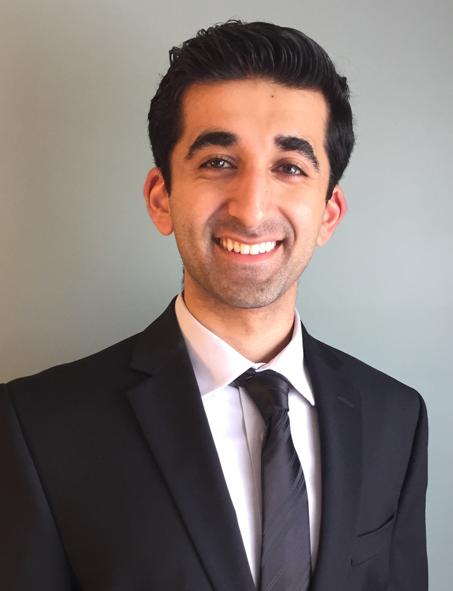

I'm a hospitalist physician, public health practicioner, and informaticist dedicated to building technologies that increase our collective agency in addressing community needs and improving our health. Much of my current work has focused on interrogating the political economy of healthcare, as well as the governance of technologies from data ecosystems to frontiers of algorithmic systems to build a healthier society.

My experience spans over 15 years across academic, regulatory, entrepreneurial, and operational contexts. I have also been extensively involved in legislative and regulatory reform on a county, state, and federal level. I’ve presented my work to the Association of Medical Directors of Information Systems, American Medical Informatics Association, Symposium on Artificial Intelligence for Learning Health Systems, and ACM Conference on Fairness, Accountability, and Transparency (FAccT), among others.

I am currently an advisory board member for [The California Telehealth Resource Center](https://caltrc.org/about/our-advisory-board/), member of the [GETTING-Plurality Research Network](https://ash.harvard.edu/programs/allen-lab-technology/), and appointee to the transition committee on [Government Operations](mamdani-transition-committee-list.pdf) for NYC Mayor-Elect Zohran Mamdani. Previously, I led the Data Modernization Strategy for the Illinois Department for Public Health. 

Previously, I was a postdoc at Cornell, working with [Emma Pierson](https://www.cs.cornell.edu/~emmapierson/), [Jon Kleinberg](https://www.cs.cornell.edu/home/kleinber/) and [Karen Levy](https://www.karen-levy.net/).  I did my PhD in computer science at MIT, where I was lucky to be advised by [John Guttag](https://people.csail.mit.edu/guttag/), [Arvind Satyanaryan](https://arvindsatya.com/), and [Catherine D'Ignazio](https://kanarinka.com/), and was part of the [Clinical and Applied Machine Learning Group](https://ddig.csail.mit.edu/), the [Visualization Group](http://vis.csail.mit.edu/), and the [Data + Feminism Lab](https://dataplusfeminism.mit.edu/). Some examples of my past work include [co-designing context-specific datasets and models](https://dl.acm.org/doi/10.1145/3531146.3533132) to support civil society activists monitoring gender-related violence, or [building systems](https://dl.acm.org/doi/10.1145/3544548.3581482) that enable people affected by ML systems to probe and evaluate models in terms of semantically-meaningful concepts that are important to their context.  During my PhD, I spent a couple summers interning at Google Brain, where I worked on [studying biases](https://arxiv.org/pdf/2011.03395.pdf) in word embedding models and building interactive [visualizations](https://github.com/PAIR-code/book-viz) of books with sentence embeddings. I also love traveling, reading, making pottery, baking, and doing aerial arts. (This website template is forked from [this repo](https://github.com/ankitsultana/researcher).)
